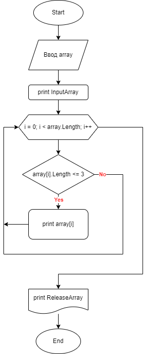

# Final_verification_work

1. Создать репозиторий на GitHub
2. Нарисовать блок-схему алгоритма (можно обойтись блок-схемой основной содержательной части, если вы выделяете её в отдельный метод)
3. Снабдить репозиторий оформленным текстовым описанием решения (файл README.md)
4. Написать программу, решающую поставленную задачу
5. Использовать контроль версий в работе над этим небольшим проектом (не должно быть так, что всё залито одним коммитом, как минимум этапы 2, 3, и 4   должны быть расположены в разных коммитах)

## Задача:
 Написать программу, которая из имеющегося массива строк формирует новый массив из строк, длина которых меньше, либо равна 3 символам. Первоначальный массив можно ввести с клавиатуры, либо задать на старте выполнения алгоритма. При решении не рекомендуется пользоваться коллекциями, лучше обойтись исключительно массивами.

### Примеры:
[“Hello”, “2”, “world”, “:-)”] → [“2”, “:-)”]  
[“1234”, “1567”, “-2”, “computer science”] → [“-2”]  
[“Russia”, “Denmark”, “Kazan”] → []

#### **Решение**:

1. Очищаем консоль.
2. Просим пользователя ввести колличество символов в массиве.
3. Создаем блок ввода данных и через цикл for со счетчиком i, шаг +1. Просим пользователя вводить элементы массива, пока i не станет равна длине массива, которую мы ввели в предыдущем пункте.
4. Выводим полученный исходный массив на экран.
5. Создаем блок с новым массивом в который передаем наш исходный массив и через цикл со счетчиком i, шаг +1. Двигаемся до конца массива.
6. Внутри цикла for проверяем больше или равна длина каждого элемента старого массива значению "3". Если да, то записываем значение в новый массив.
7. Выводим пустую строку для наглядности.
8. Выводим полученный конечный массив на экран.

### Блок-схема алгоритма (основана на псевдокоде):

